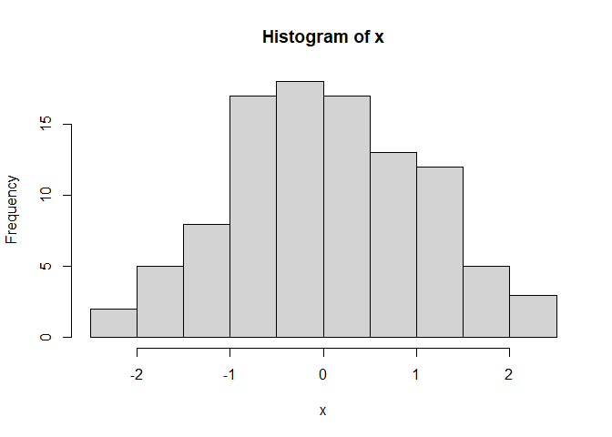

Recurrent models based on Cox regression
================
Nayef
2022-01-06

-   [1 Libraries](#libraries)
-   [2 Test](#test)

# 1 Libraries

``` r
library(survival)
```

# 2 Test

``` r
x <- rnorm(100)
hist(x)
```

<!-- -->
