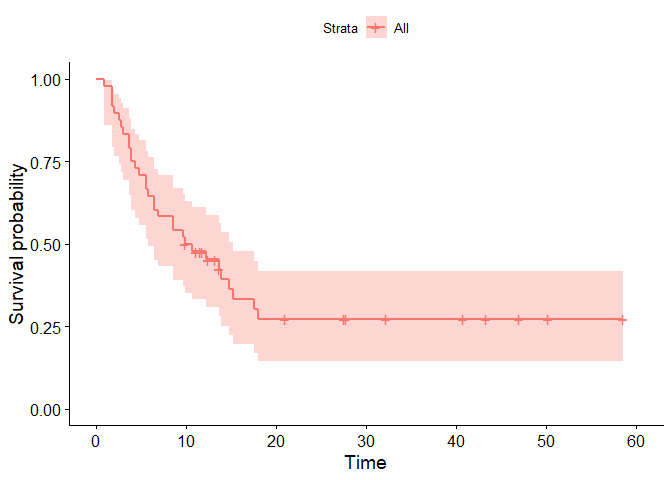
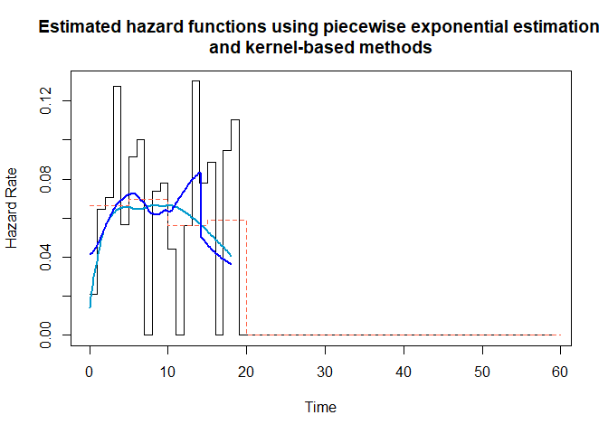
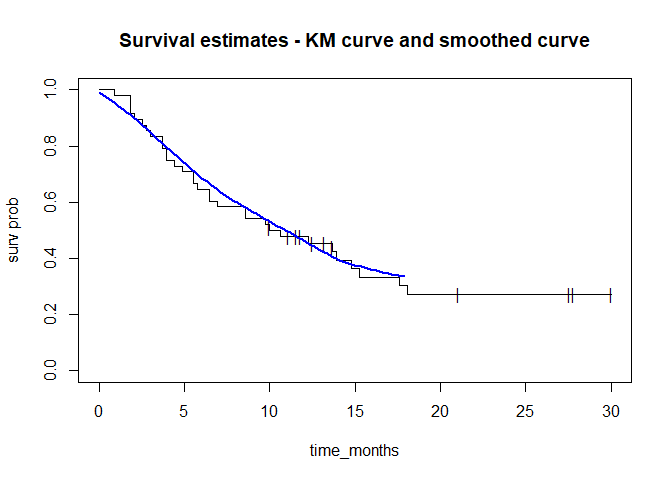
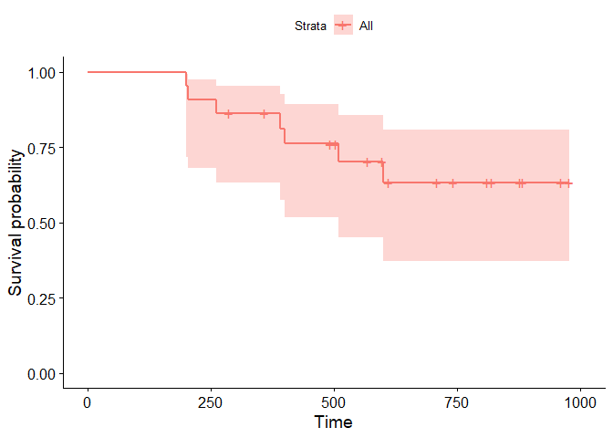
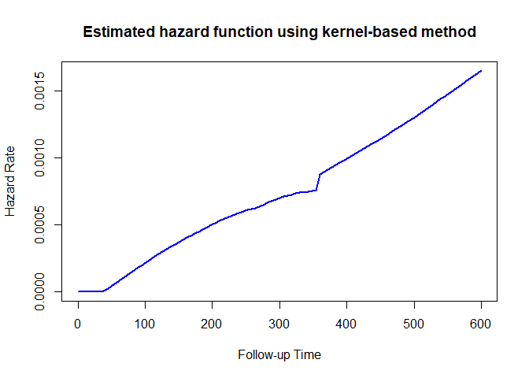
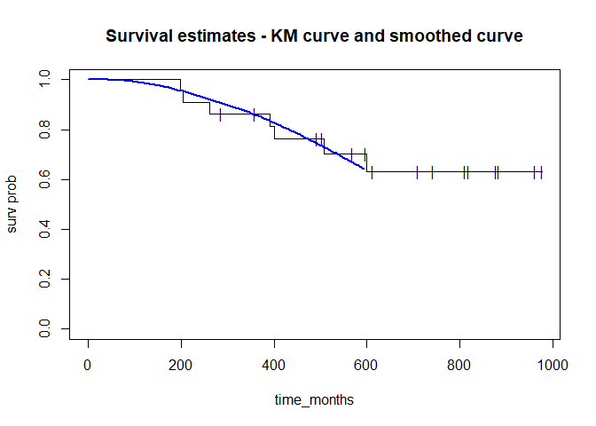

Smoothing the KM estimate
================
Nayef
2022-01-06

-   [1 Overview](#overview)
-   [2 Libraries](#libraries)
-   [3 Example 1](#example-1)
    -   [3.1 Dataset: Progression-free survival of gastric
        cancer](#dataset-progression-free-survival-of-gastric-cancer)
    -   [3.2 KM curve](#km-curve)
    -   [3.3 Smoothed hazard functions](#smoothed-hazard-functions)
    -   [3.4 Deriving smoothed survival estimtate from smoothed hazard
        function](#deriving-smoothed-survival-estimtate-from-smoothed-hazard-function)
    -   [3.5 Plotting KM and smoothed survival
        estimates](#plotting-km-and-smoothed-survival-estimates)
-   [4 Example 2](#example-2)
    -   [4.1 KM curve](#km-curve-1)
    -   [4.2 Smoothed hazard functions](#smoothed-hazard-functions-1)
    -   [4.3 Deriving smoothed survival estimtate from smoothed hazard
        function](#deriving-smoothed-survival-estimtate-from-smoothed-hazard-function-1)
    -   [4.4 Plotting KM and smoothed survival
        estimates](#plotting-km-and-smoothed-survival-estimates-1)

# 1 Overview

Reference: DF Moore, *“Applied Survival Analysis Using R”*, p32.

Use case: when making predictions based on small samples, the
step-function nature of the KM curve means that we often assign zero
probability to the occurrence of an event. This is not reasonable in
many cases. A smoothed survival estimate will avoid this issue.

We use the following relationship to get the survival function from the
hazard function:

*S*(*t*) = *e*<sup>( − *H*(*t*))</sup> = *e*<sup>(∫<sub>0</sub><sup>*t*</sup>*h*(*x*)*d**x*)</sup>

# 2 Libraries

``` r
library(survival)
```

    ## Warning: package 'survival' was built under R version 4.0.5

``` r
library(asaur)
```

    ## Warning: package 'asaur' was built under R version 4.0.3

``` r
library(survminer)
```

    ## Warning: package 'survminer' was built under R version 4.0.5

    ## Loading required package: ggplot2

    ## Warning: package 'ggplot2' was built under R version 4.0.5

    ## Loading required package: ggpubr

    ## Warning: package 'ggpubr' was built under R version 4.0.3

    ## 
    ## Attaching package: 'survminer'

    ## The following object is masked from 'package:survival':
    ## 
    ##     myeloma

``` r
library(muhaz)
```

    ## Warning: package 'muhaz' was built under R version 4.0.5

# 3 Example 1

## 3.1 Dataset: Progression-free survival of gastric cancer

``` r
# ?gastricXelox
time_months <- gastricXelox$timeWeeks * 7/30.25
delta <- gastricXelox$delta  # 1 for death, 0 for censored 

str(gastricXelox)
```

    ## 'data.frame':    48 obs. of  2 variables:
    ##  $ timeWeeks: int  4 8 8 8 9 11 12 13 16 16 ...
    ##  $ delta    : int  1 1 1 1 1 1 1 1 1 1 ...

``` r
stopifnot(nrow(gastricXelox) == 48)
```

## 3.2 KM curve

``` r
km1 <- survfit(Surv(time_months, delta) ~ 1, conf.type = "log-log")

km1
```

    ## Call: survfit(formula = Surv(time_months, delta) ~ 1, conf.type = "log-log")
    ## 
    ##       n events median 0.95LCL 0.95UCL
    ## [1,] 48     32   10.3    5.79    15.3

``` r
ggsurvplot(km1, data = gastricXelox)
```

<!-- -->

``` r
# plot(km1, conf.int = T, mark = "|", xlab = "time_months", ylab = "surv prob")
```

## 3.3 Smoothed hazard functions

-   Uses `muhaz::pehaz` to estimate piecewise exponential hazard
    function from right-censored data.
-   `width = 5` means we split the time axis and “bin” into intervals of
    length 5 months.

``` r
# ?pehaz
# ?muhaz
hazard_1_month_bin <- pehaz(time_months, delta, width = 1)
```

    ## 
    ## max.time= 58.54545
    ## width= 1
    ## nbins= 59

``` r
hazard_5_month_bin <- pehaz(time_months, delta, width = 5)
```

    ## 
    ## max.time= 58.54545
    ## width= 5
    ## nbins= 12

``` r
hazard_smooth <- muhaz(time_months, delta, 
                       bw.smooth = 20, 
                       b.cor = "left")
hazard_smooth_auto <- muhaz(time_months, delta,
                            bw.method = "local")


plot(hazard_1_month_bin)
lines(hazard_5_month_bin, col = "tomato")
lines(hazard_smooth, col = "deepskyblue3", lwd = 2)
lines(hazard_smooth_auto, col = "blue", lwd = 2)

title("Estimated hazard functions using piecewise exponential estimation \nand kernel-based methods")
```

<!-- -->

## 3.4 Deriving smoothed survival estimtate from smoothed hazard function

``` r
hazard_values <- hazard_smooth_auto$haz.est
times <- hazard_smooth_auto$est.grid
n_haz <- length(hazard_values)

smooth_surv <- exp(-cumsum(hazard_values[1:n_haz - 1] * diff(times)))
```

## 3.5 Plotting KM and smoothed survival estimates

``` r
plot(km1, conf.int = F, mark = "|", 
     xlab = "time_months", ylab = "surv prob", 
     xlim = c(0, 30))
lines(smooth_surv ~ times[1:(length(times) - 1)], col = "blue", lwd =2)
title("Survival estimates - KM curve and smoothed curve")
```

<!-- -->

# 4 Example 2

``` r
df <- tibble::tribble(
   ~time, ~event,
   810.8,     0L,
   199.7,     1L,
   504.4,     0L,
  400.39,     1L,
   742.9,     0L,
     976,     0L,
   960.7,     0L,
   204.5,     1L,
   597.1,     0L,
   599.6,     1L,
     493,     0L,
   883.5,     0L,
   261.7,     1L,
   568.3,     0L,
   877.5,     0L,
   358.6,     0L,
     819,     0L,
   508.3,     1L,
   287.1,     0L,
   391.2,     1L,
   611.7,     0L,
     709,     0L
  )

str(df)
```

    ## tibble [22 x 2] (S3: tbl_df/tbl/data.frame)
    ##  $ time : num [1:22] 811 200 504 400 743 ...
    ##  $ event: int [1:22] 0 1 0 1 0 0 0 1 0 1 ...

``` r
stopifnot(nrow(df) == 22)
```

## 4.1 KM curve

``` r
km2 <- survfit(Surv(df$time, df$event) ~ 1, conf.type = "log-log")

km2
```

    ## Call: survfit(formula = Surv(df$time, df$event) ~ 1, conf.type = "log-log")
    ## 
    ##       n events median 0.95LCL 0.95UCL
    ## [1,] 22      7     NA     508      NA

``` r
ggsurvplot(km2, data = df)
```

<!-- -->

``` r
# plot(km1, conf.int = T, mark = "|", xlab = "time_months", ylab = "surv prob")
```

## 4.2 Smoothed hazard functions

``` r
hazard_smooth_auto2 <- muhaz(df$time, df$event,
                            bw.method = "local")


plot(hazard_smooth_auto2, col = "blue", lwd = 2)
title("Estimated hazard function using kernel-based method")
```

<!-- -->

## 4.3 Deriving smoothed survival estimtate from smoothed hazard function

``` r
hazard_values2 <- hazard_smooth_auto2$haz.est
times2 <- hazard_smooth_auto2$est.grid
n_haz2 <- length(hazard_values2)

smooth_surv2 <- exp(-cumsum(hazard_values2[1:n_haz - 1] * diff(times2)))
```

## 4.4 Plotting KM and smoothed survival estimates

``` r
plot(km2, conf.int = F, mark = "|", 
     xlab = "time_months", ylab = "surv prob")
lines(smooth_surv2 ~ times2[1:(length(times2) - 1)], col = "blue", lwd =2)
title("Survival estimates - KM curve and smoothed curve")
```

<!-- -->
